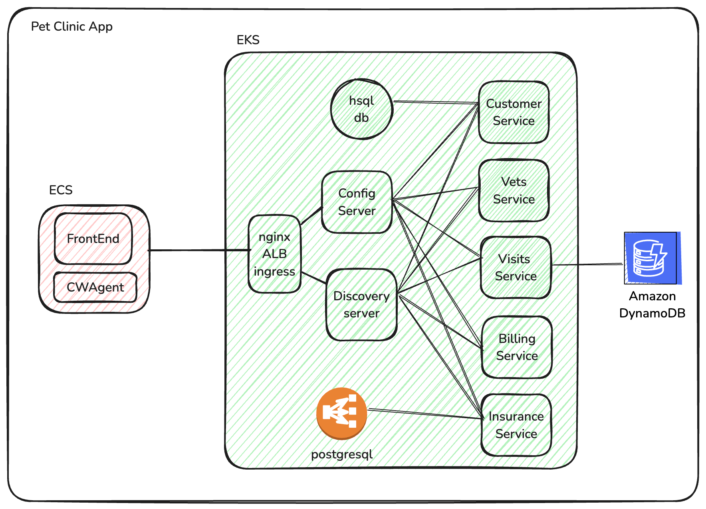

# Introduction
This is a modified version of the [spring-petclinic-microservices](https://github.com/spring-petclinic/spring-petclinic-microservices) Spring Boot sample application. 
Our modifications focus on showcasing the capabilities of Application Signals within a Spring Boot environment.
If your interest lies in exploring the broader aspects of the Spring Boot stack, we recommend visiting the original repository at [spring-petclinic-microservices](https://github.com/spring-petclinic/spring-petclinic-microservices).

In the following, we will focus on how customers can set up the current sample application to explore the features of Application Signals.

# Prerequisite
* A Linux or Mac machine with x86-64 (AMD64) architecture is required for building Docker images for the sample application.
* Docker is installed and running on the machine.
* AWS CLI 2.x is installed. For more information about installing the AWS CLI, see [Install or update the latest version of the AWS CLI](https://docs.aws.amazon.com/cli/latest/userguide/getting-started-install.html).
* kubectl is installed - https://docs.aws.amazon.com/eks/latest/userguide/install-kubectl.html
* eksctl is installed - https://docs.aws.amazon.com/eks/latest/userguide/eksctl.html
* jq is installed - https://jqlang.github.io/jq/download/
* [Optional] If you plan to install the infrastructure resources using Terraform, terraform cli is required. https://developer.hashicorp.com/terraform/tutorials/aws-get-started/install-cli
* [Optional] If you want to try out AWS Bedrock/GenAI support with Application Signals, enable Amazon Titian, Anthropic Claude, Meta Llama foundation models by following the instructions in https://docs.aws.amazon.com/bedrock/latest/userguide/model-access.html


# Architecture Diagram

The following diagram represents the architecture of the pet clinic app. Front-end service is exposed to public endpoint using NLB and communicates with ConfigService and DiscoveryServer through ALB endpoint exposed using nginx ingress in EKS cluster. 





# EKS + ECS demo setup

### How to setup everything from scratch?

1. Build container images for each micro-service application

``` shell

./mvnw clean install -P buildDocker
```

2. Create an ECR repo for each micro service and push the images to the relevant repos. Replace the aws account id and the AWS Region.

``` shell
export ACCOUNT=`aws sts get-caller-identity | jq .Account -r`
export REGION='us-east-1'
./push-ecr.sh
```

3. Create an EKS cluster, ECS cluster, enable Application Signals, and deploy the sample application to your EKS and ECS cluster. Replace `new-cluster-name` with the name that you want to use for the new cluster. Replace `region-name` with the same region in previous section "**Build the sample application images and push to ECR**".

``` shell
cd scripts/eks/appsignals/one-step && ./setup.sh new-cluster-name region-name
```

### How to teardown the application?

Clean up all the resources which were created in the previous step. Replace `new-cluster-name` and `region-name` with the same values that you use in previous step.

``` shell
cd scripts/eks/appsignals/one-step && ./cleanup.sh new-cluster-name region-name
```

If you want to setup the application again, you don't have to push docker images to ECR again, just run the setup command to setup ECS and EKS clusters : 
```
cd scripts/eks/appsignals/one-step && ./setup.sh new-cluster-name region-name
```

